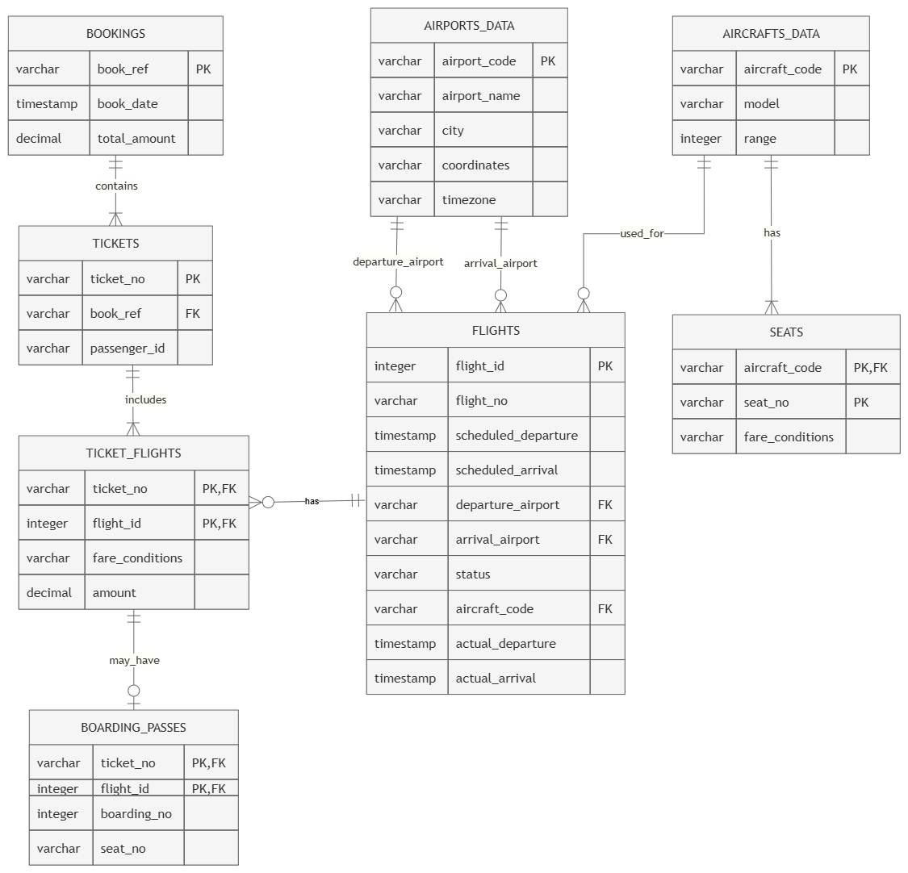

# 01 - แผนภาพความสัมพันธ์ของฐานข้อมูลเชิงปฏิบัติการ (OLTP ER Diagram)

## 1. ภาพรวมฐานข้อมูล

ฐานข้อมูลเชิงปฏิบัติการของโครงงาน Airline Data Warehouse ประกอบด้วยข้อมูลต้นทางทั้งหมด 8 ตาราง ได้แก่

1. bookings
2. tickets
3. ticket_flights
4. flights
5. boarding_passes
6. airports_data
7. aircrafts_data
8. seats

ฐานข้อมูลชุดนี้ใช้จัดเก็บข้อมูลเกี่ยวกับการจองตั๋วโดยสาร ตั๋วโดยสาร เที่ยวบิน บัตรขึ้นเครื่อง สนามบิน รุ่นเครื่องบิน และโครงสร้างที่นั่งของเครื่องบิน

---

## 2. รายละเอียดแต่ละตาราง

### BOOKINGS

Primary Key:
- book_ref

Attributes:
- book_ref
- book_date
- total_amount

คำอธิบาย:
ใช้จัดเก็บข้อมูลการจองตั๋วโดยสาร โดยการจองแต่ละครั้งจะมีรหัสอ้างอิงการจอง วันที่ทำรายการ และยอดรวมของการจอง

---

### TICKETS

Primary Key:
- ticket_no

Foreign Key:
- book_ref → bookings.book_ref

Attributes:
- ticket_no
- book_ref
- passenger_id

คำอธิบาย:
ใช้จัดเก็บข้อมูลตั๋วโดยสารของผู้โดยสาร โดยตั๋วแต่ละใบจะอ้างอิงไปยังรายการจองหนึ่งรายการ

---

### TICKET_FLIGHTS

Composite Primary Key:
- ticket_no
- flight_id

Foreign Keys:
- ticket_no → tickets.ticket_no
- flight_id → flights.flight_id

Attributes:
- ticket_no
- flight_id
- fare_conditions
- amount

คำอธิบาย:
ใช้จัดเก็บความสัมพันธ์ระหว่างตั๋วโดยสารและเที่ยวบิน โดยหนึ่งระเบียนหมายถึงตั๋วหนึ่งใบสำหรับเที่ยวบินหนึ่งช่วง

---

### FLIGHTS

Primary Key:
- flight_id

Foreign Keys:
- departure_airport → airports_data.airport_code
- arrival_airport → airports_data.airport_code
- aircraft_code → aircrafts_data.aircraft_code

Attributes:
- flight_id
- flight_no
- scheduled_departure
- scheduled_arrival
- departure_airport
- arrival_airport
- status
- aircraft_code
- actual_departure
- actual_arrival

คำอธิบาย:
ใช้จัดเก็บข้อมูลเที่ยวบิน เช่น หมายเลขเที่ยวบิน เวลาเดินทางตามกำหนด สนามบินต้นทาง สนามบินปลายทาง สถานะเที่ยวบิน รุ่นเครื่องบิน และเวลาเดินทางจริง

---

### BOARDING_PASSES

Composite Primary Key:
- ticket_no
- flight_id

Foreign Key:
- ticket_no + flight_id → ticket_flights

Attributes:
- ticket_no
- flight_id
- boarding_no
- seat_no

คำอธิบาย:
ใช้จัดเก็บข้อมูลบัตรขึ้นเครื่องของผู้โดยสาร เช่น ลำดับการขึ้นเครื่องและหมายเลขที่นั่ง

---

### AIRPORTS_DATA

Primary Key:
- airport_code

Attributes:
- airport_code
- airport_name
- city
- coordinates
- timezone

คำอธิบาย:
ใช้จัดเก็บข้อมูลหลักของสนามบิน เช่น รหัสสนามบิน ชื่อสนามบิน เมือง พิกัด และเขตเวลา

---

### AIRCRAFTS_DATA

Primary Key:
- aircraft_code

Attributes:
- aircraft_code
- model
- range

คำอธิบาย:
ใช้จัดเก็บข้อมูลรุ่นเครื่องบิน เช่น รหัสรุ่น ชื่อรุ่น และระยะทางบินสูงสุด

---

### SEATS

Composite Primary Key:
- aircraft_code
- seat_no

Foreign Key:
- aircraft_code → aircrafts_data.aircraft_code

Attributes:
- aircraft_code
- seat_no
- fare_conditions

คำอธิบาย:
ใช้จัดเก็บโครงสร้างที่นั่งของแต่ละรุ่นเครื่องบิน รวมถึงประเภทชั้นโดยสารของแต่ละที่นั่ง

---

## 3. ความสัมพันธ์ระหว่างตาราง

| ตารางต้นทาง | ตารางปลายทาง | ความสัมพันธ์ | คำอธิบาย |
|---|---|---|---|
| bookings | tickets | 1 : N | การจองหนึ่งรายการสามารถมีตั๋วได้หลายใบ |
| tickets | ticket_flights | 1 : N | ตั๋วหนึ่งใบสามารถใช้กับหลายช่วงเที่ยวบินได้ |
| flights | ticket_flights | 1 : N | เที่ยวบินหนึ่งเที่ยวสามารถมีตั๋วโดยสารได้หลายรายการ |
| ticket_flights | boarding_passes | 1 : 0..1 | ตั๋วสำหรับเที่ยวบินหนึ่งรายการอาจมีหรือยังไม่มี Boarding Pass |
| airports_data | flights | 1 : N | สนามบินหนึ่งแห่งสามารถเป็นสนามบินต้นทางของหลายเที่ยวบิน |
| airports_data | flights | 1 : N | สนามบินหนึ่งแห่งสามารถเป็นสนามบินปลายทางของหลายเที่ยวบิน |
| aircrafts_data | flights | 1 : N | เครื่องบินหนึ่งรุ่นสามารถถูกใช้ในหลายเที่ยวบิน |
| aircrafts_data | seats | 1 : N | เครื่องบินหนึ่งรุ่นมีที่นั่งหลายตำแหน่ง |

---

## 4. ER Diagram

