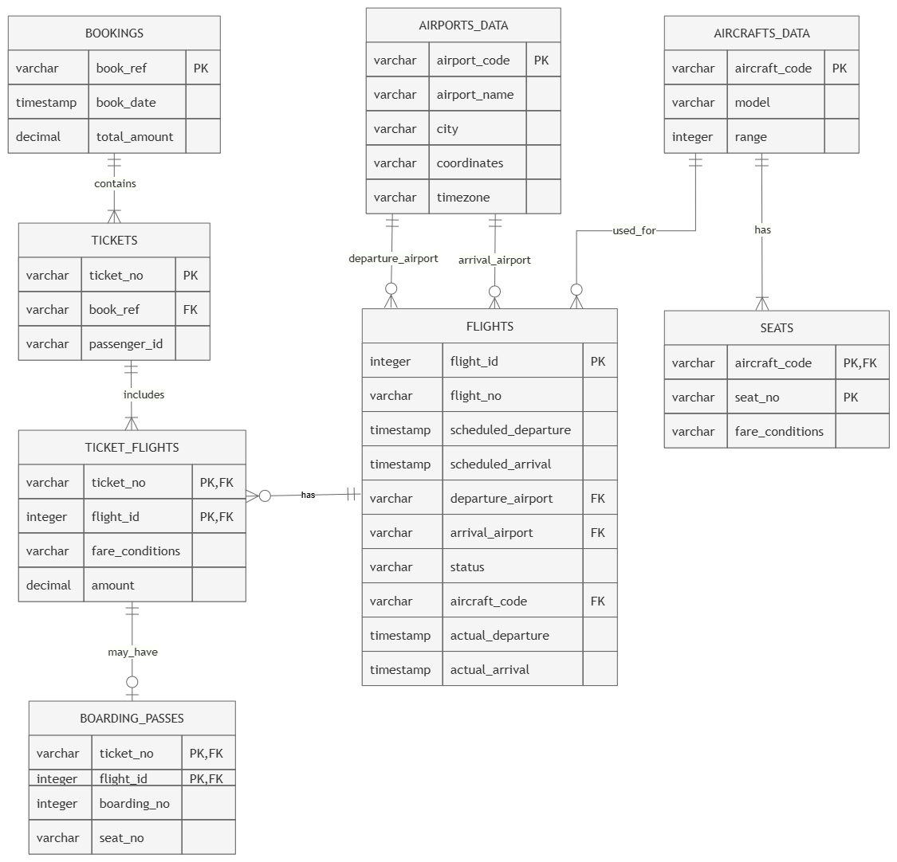

# 01 - แผนภาพความสัมพันธ์ของฐานข้อมูลเชิงปฏิบัติการ (OLTP ER Diagram)

## 1. ภาพรวมฐานข้อมูล

ฐานข้อมูลต้นทางของโครงงาน Airline Data Warehouse ประกอบด้วยข้อมูลทั้งหมด 8 ตาราง ได้แก่

1. bookings
2. tickets
3. ticket_flights
4. flights
5. boarding_passes
6. airports_data
7. aircrafts_data
8. seats

ข้อมูลต้นทางครอบคลุมตั้งแต่กระบวนการจองตั๋วโดยสาร ข้อมูลผู้โดยสาร เที่ยวบิน บัตรขึ้นเครื่อง สนามบิน เครื่องบิน และโครงสร้างที่นั่ง โดยตารางต่าง ๆ มีความสัมพันธ์กันผ่าน Primary Key และ Foreign Key เพื่อเชื่อมโยงข้อมูลในแต่ละกระบวนการ

---

## 2. รายละเอียดแต่ละตาราง

### BOOKINGS

**Primary Key**
- `book_ref`

**Attributes**
- `book_ref`
- `book_date`
- `total_amount`

**คำอธิบาย**  
ใช้จัดเก็บข้อมูลการจองตั๋วโดยสาร โดยแต่ละการจองมีรหัสอ้างอิง วันที่จอง และยอดรวมของการจอง

---

### TICKETS

**Primary Key**
- `ticket_no`

**Foreign Key**
- `book_ref` → `bookings.book_ref`

**Attributes**
- `ticket_no`
- `book_ref`
- `passenger_id`
- `passenger_name`

**คำอธิบาย**  
ใช้จัดเก็บข้อมูลตั๋วโดยสารและผู้โดยสาร โดยตั๋วแต่ละใบเชื่อมโยงกับรายการจองผ่าน `book_ref`

---

### TICKET_FLIGHTS

**Composite Primary Key**
- `ticket_no`
- `flight_id`

**Foreign Keys**
- `ticket_no` → `tickets.ticket_no`
- `flight_id` → `flights.flight_id`

**Attributes**
- `ticket_no`
- `flight_id`
- `fare_conditions`
- `amount`

**คำอธิบาย**  
ใช้เป็นตารางเชื่อมระหว่างตั๋วโดยสารและเที่ยวบิน โดยหนึ่งรายการหมายถึงตั๋วหนึ่งใบที่ใช้กับเที่ยวบินหนึ่งเที่ยว พร้อมระบุชั้นโดยสารและราคาตั๋ว

---

### FLIGHTS

**Primary Key**
- `flight_id`

**Foreign Keys**
- `departure_airport` → `airports_data.airport_code`
- `arrival_airport` → `airports_data.airport_code`
- `aircraft_code` → `aircrafts_data.aircraft_code`

**Attributes**
- `flight_id`
- `flight_no`
- `scheduled_departure`
- `scheduled_arrival`
- `departure_airport`
- `arrival_airport`
- `status`
- `aircraft_code`
- `actual_departure`
- `actual_arrival`

**คำอธิบาย**  
ใช้จัดเก็บข้อมูลเที่ยวบิน ได้แก่ หมายเลขเที่ยวบิน เวลาออกและเวลาถึงตามกำหนด สนามบินต้นทาง สนามบินปลายทาง สถานะเที่ยวบิน เครื่องบินที่ใช้ และเวลาเดินทางจริง

---

### BOARDING_PASSES

**Composite Primary Key**
- `ticket_no`
- `flight_id`

**Foreign Key**
- (`ticket_no`, `flight_id`) → `ticket_flights`

**Attributes**
- `ticket_no`
- `flight_id`
- `boarding_no`
- `seat_no`

**คำอธิบาย**  
ใช้จัดเก็บข้อมูลบัตรขึ้นเครื่องของผู้โดยสาร โดยเชื่อมโยงกับตั๋วและเที่ยวบิน พร้อมข้อมูลลำดับการขึ้นเครื่องและหมายเลขที่นั่ง

---

### AIRPORTS_DATA

**Primary Key**
- `airport_code`

**Attributes**
- `airport_code`
- `airport_name`
- `city`
- `country`
- `analysis_region`

**คำอธิบาย**  
ใช้จัดเก็บข้อมูลสนามบิน เช่น รหัสสนามบิน ชื่อสนามบิน เมือง ประเทศ และภูมิภาคที่ใช้สำหรับการวิเคราะห์

ตารางนี้ถูกอ้างอิงจาก `flights` ใน 2 บทบาท ได้แก่
- สนามบินต้นทางผ่าน `departure_airport`
- สนามบินปลายทางผ่าน `arrival_airport`

---

### AIRCRAFTS_DATA

**Primary Key**
- `aircraft_code`

**Attributes**
- `aircraft_code`
- `model`
- `range`
- `manufacturer`

**คำอธิบาย**  
ใช้จัดเก็บข้อมูลเครื่องบิน เช่น รหัสเครื่องบิน รุ่น ระยะทางบิน และผู้ผลิตเครื่องบิน

---

### SEATS

**Composite Primary Key**
- `aircraft_code`
- `seat_no`

**Foreign Key**
- `aircraft_code` → `aircrafts_data.aircraft_code`

**Attributes**
- `aircraft_code`
- `seat_no`
- `fare_conditions`

**คำอธิบาย**  
ใช้จัดเก็บโครงสร้างที่นั่งของเครื่องบินแต่ละรุ่น โดยระบุหมายเลขที่นั่งและประเภทชั้นโดยสาร

---

## 3. ความสัมพันธ์ระหว่างตาราง

| ตารางต้นทาง | ตารางปลายทาง | Key ที่ใช้เชื่อม | ความสัมพันธ์ | คำอธิบาย |
|---|---|---|---|---|
| bookings | tickets | `book_ref` | 1 : N | การจองหนึ่งรายการสามารถมีตั๋วหลายใบ |
| tickets | ticket_flights | `ticket_no` | 1 : N | ตั๋วหนึ่งใบสามารถใช้กับหลายเที่ยวบินได้ |
| flights | ticket_flights | `flight_id` | 1 : N | เที่ยวบินหนึ่งเที่ยวสามารถมีรายการตั๋วได้หลายรายการ |
| ticket_flights | boarding_passes | `ticket_no`, `flight_id` | 1 : 0..1 | ตั๋วสำหรับเที่ยวบินหนึ่งรายการอาจมี Boarding Pass หรือยังไม่มี |
| airports_data | flights | `airport_code` → `departure_airport` | 1 : N | สนามบินหนึ่งแห่งสามารถเป็นต้นทางของหลายเที่ยวบิน |
| airports_data | flights | `airport_code` → `arrival_airport` | 1 : N | สนามบินหนึ่งแห่งสามารถเป็นปลายทางของหลายเที่ยวบิน |
| aircrafts_data | flights | `aircraft_code` | 1 : N | เครื่องบินหนึ่งรุ่นสามารถถูกใช้กับหลายเที่ยวบิน |
| aircrafts_data | seats | `aircraft_code` | 1 : N | เครื่องบินหนึ่งรุ่นมีที่นั่งหลายตำแหน่ง |

---

## 4. ER Diagram

แผนภาพต่อไปนี้แสดงความสัมพันธ์ระหว่างตารางข้อมูลต้นทาง โดยใช้ Crow's Foot Notation เพื่อแสดง Cardinality ของแต่ละความสัมพันธ์

---

## 5. สรุปโครงสร้างความสัมพันธ์

โครงสร้างข้อมูลเริ่มต้นจากการจอง (`bookings`) ซึ่งเชื่อมโยงไปยังตั๋วโดยสาร (`tickets`) และรายละเอียดเที่ยวบินของตั๋ว (`ticket_flights`) จากนั้นเชื่อมต่อไปยังข้อมูลเที่ยวบิน (`flights`) และบัตรขึ้นเครื่อง (`boarding_passes`)

ตาราง `flights` เชื่อมโยงกับ `airports_data` เพื่อระบุสนามบินต้นทางและปลายทาง และเชื่อมโยงกับ `aircrafts_data` เพื่อระบุเครื่องบินที่ใช้ในแต่ละเที่ยวบิน ขณะที่ `aircrafts_data` เชื่อมโยงกับ `seats` เพื่อแสดงโครงสร้างที่นั่งของเครื่องบินแต่ละรุ่น

ER Diagram นี้จึงแสดงความสัมพันธ์ของข้อมูลต้นทางก่อนเข้าสู่กระบวนการ ETL และการสร้าง Data Warehouse
